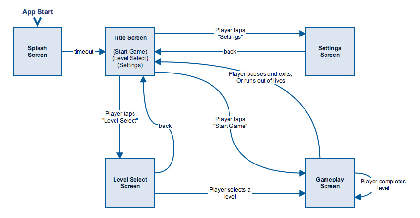

# Design Document

## Summary
The gameplay of this game is almost identical to titles such as Breakout and Arkanoid. According to [Wikipedia](http://en.wikipedia.org/wiki/Breakout_%28video_game%29), we will describe this gameplay as:

>In the game, a layer of bricks lines the top third of the screen. A ball travels across the screen, bouncing off the top and side walls of the screen. When a brick is hit, the ball bounces away and the brick is destroyed. The player loses a turn when the ball touches the bottom of the screen. To prevent this from happening, the player has a movable paddle to bounce the ball upward, keeping it in play.

Our game will take advantage the vertical format of a phone to give a tall playing field.

## Game Flow
Each blue square in this diagram represents a "game screen" that the player sees. An arrow represents some sort of transition from one screen to another.

Each game screen can be considered a *game state*, which Phaser provides logic for. A game state may have substates.

